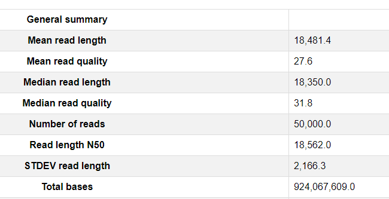
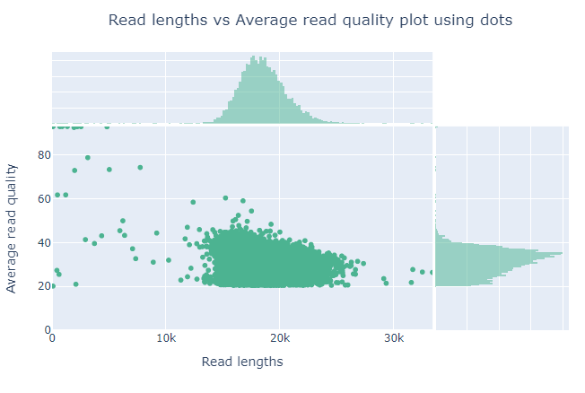
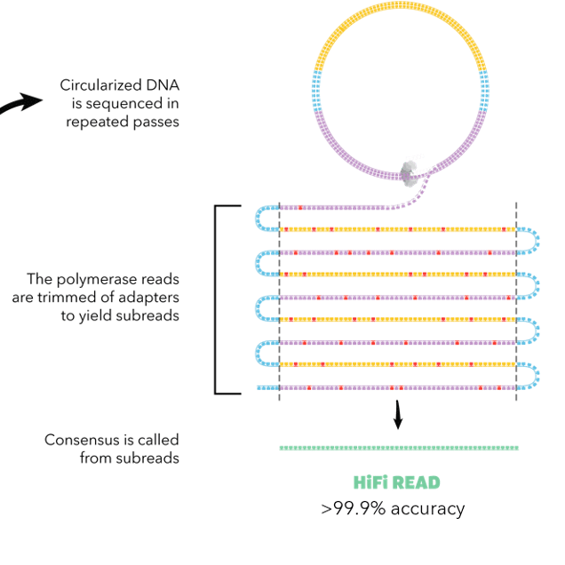
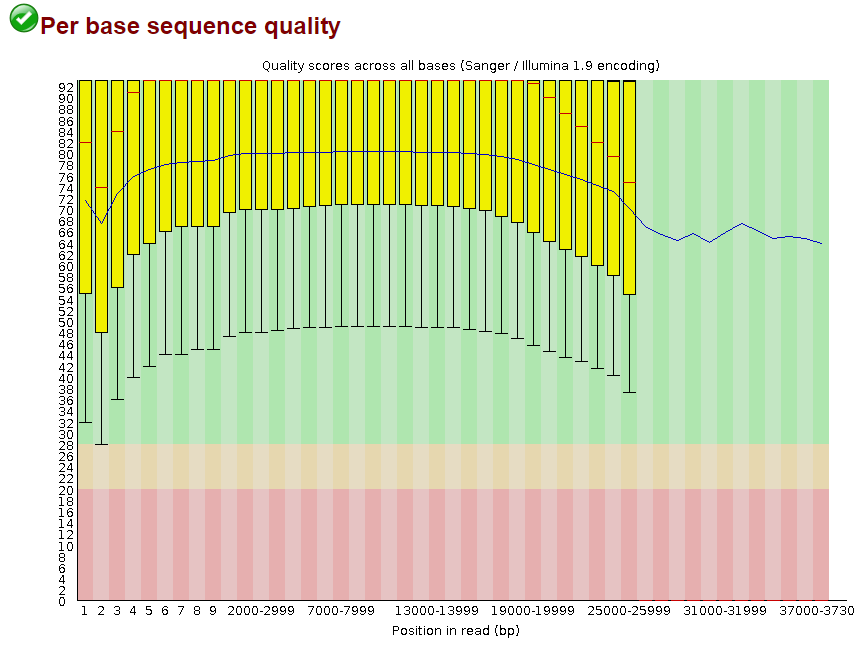
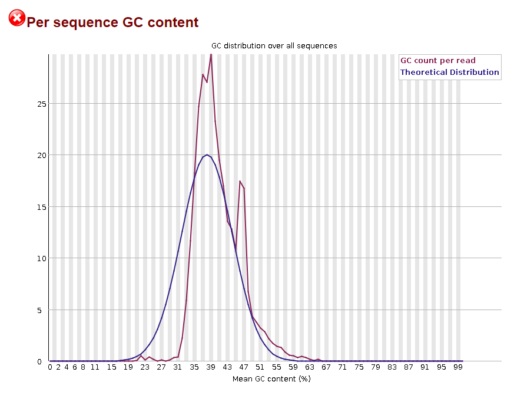
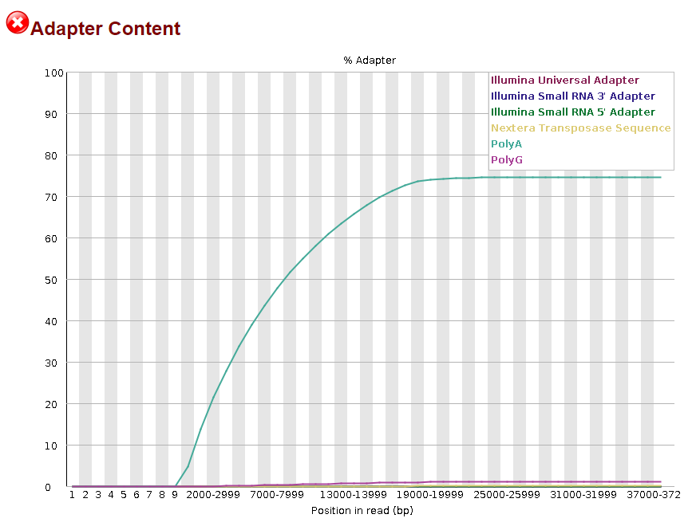

### Exercise 1: Run Nanoplot and FASTQC

Answers for [Quality control of long read data]({{site.baseurl}}/modules/sequencing/long-read-qc)

```
NanoPlot --fastq m64011_190830_220126.Q20.subsample.fastq.gz  --plots  kde hex  dot --N50
```

**What do each of the parameters (of the command above) mean?**

Look at the help 

```
NanoPlot -h
```

* `--plots kde hex dot`: Specify which bivariate plots have to be made.
* `--N50`: Show the N50 mark in the read length histogram
* `--fastq`: Data is in one or more fastq file(s) 
* `m64011_190830_220126.Q20.subsample.fastq.gz`: The fastq file to analyse

**Inspect the generated HTML file**
Open `NanoPlot-report.html`. You may need to download these files to your local to read them properly. 

**What is the median read quality, mean read quality and read N50?**



**Looking at "Read lengths vs Average read quality plot using dots plot". Did you notice something unusual with the Qscore? Can you explain it?** 

This plot shows the distribution of fragment sizes according to the Qscore in the file which was analysed. In general, there is no link between read length and read quality but this representation allows to visualize both information into a single plot and detect possible aberrations. In runs with a lot of short reads the shorter reads are sometimes of lower quality than the rest.



There is no reads under Q20. By the way, The qualification for HiFi reads is:

* A minimal number of 3 subreads
* A read Qscore >=20



**Repeat this with FASTQC**

Looks pretty good to me! But I (Nabil) am not a human person. 



Maybe the GC content is a bit suspicious. 



I don't think you should see PolyAs here. 



[Back to Programme]({{site.baseurl}}/modules/sequencing/week-2-programme/).