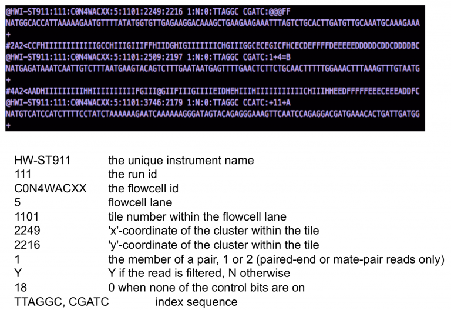
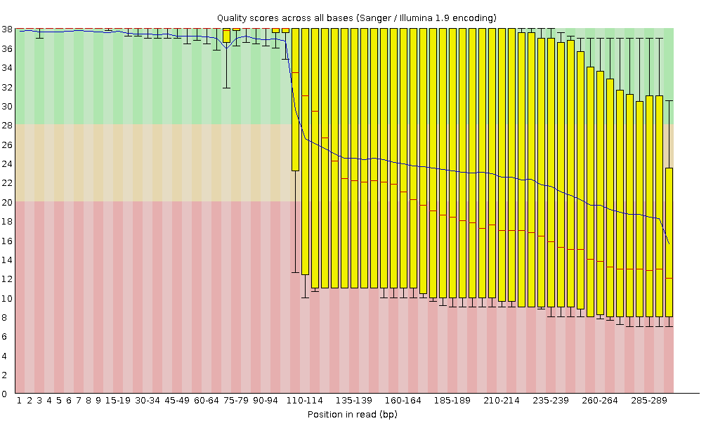
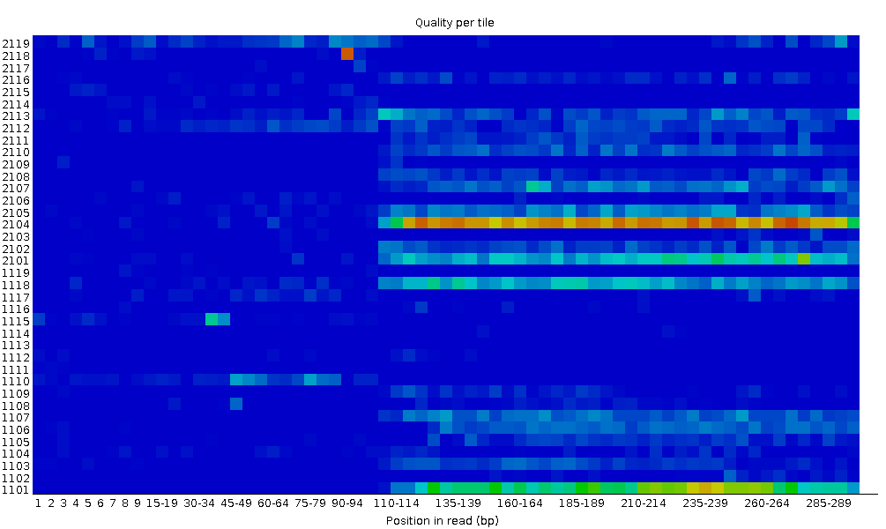
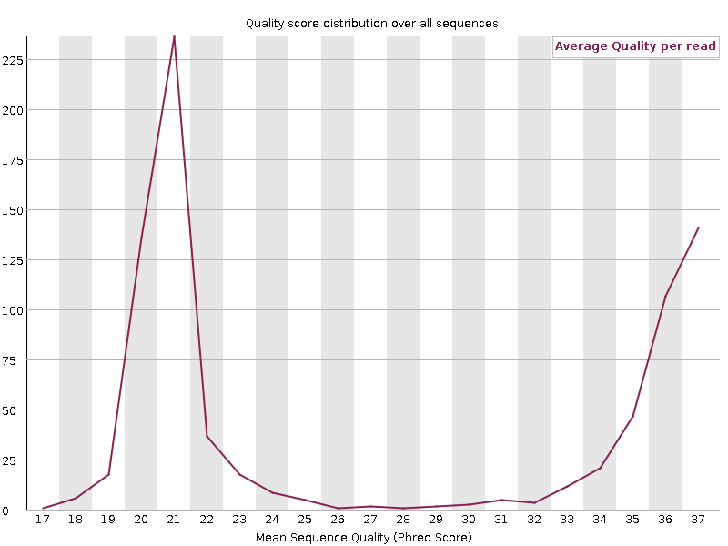
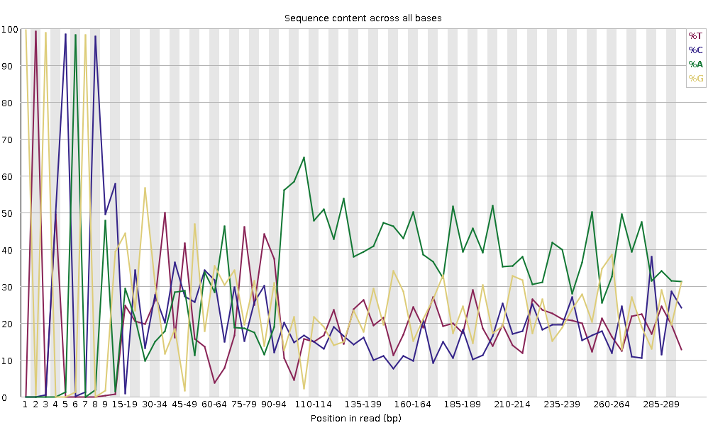
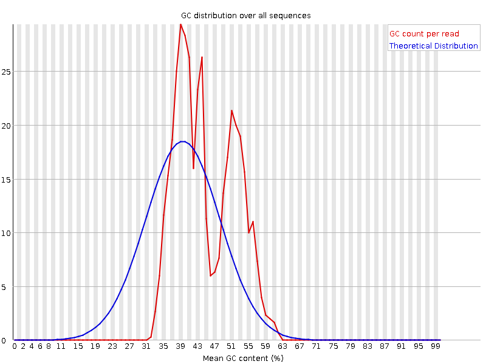
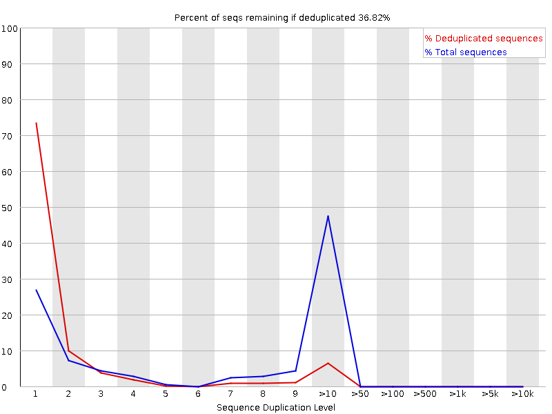

Answers for [short-read-qc exercises]({{site.baseurl}}/modules/sequencing/short-read-qc/)

### Exercise 1: Run FASTQE

**Run FASTQE on the example data, pKP1-NDM-1_R1.fastq.gz and female_oral2.fastq.gz. One at a time. Which data has the better average quality?**

```bash
fastqe female_oral2.fastq.gz 
fastqe pKP1-NDM-1_R1.fastq.gz 
```



pKP1-NDM-1_R1.fastq.gz has the better quality. 

**Which portion of read has the lower average quality, and for which file?**

The tail end (3') of female_oral2.fastq.gz has the lowest average quality.

**What is the lowest mean score in female_oral2.fastq.gz?**

The lowest score in this dataset is 😿 13.

### Exercise 2: Run FASTQC

* Run FASTQC on female_oral2.fastq.gz.
* Run FASTQC on pKP1-NDM-1_R1.fastq.gz and pKP1-NDM-1_R2.fastq.gz together.
* Review and compare the HTML reports.

```bash
fastqc female_oral2.fastq.gz 
fastqc pKP1-NDM-1_R1.fastq.gz pKP1-NDM-1_R2.fastq.gz 
```

**Which metrics are a major difference between the two reports?**

* Per base sequence quality
* Per sequence quality scores
* Per base sequence content
* Per sequence GC content
* Sequence Duplication Levels
* Overrepresented sequences
* Adapter Content

**What is the parts of the report are missing for pKP1-NDM? Can you explain why?**

* Per tile sequence quality

Look at the FASTQ file header for pKP1-NDM-1_R1.fastq.gz.
```bash
zcat pKP1-NDM-1_R1.fastq.gz | head -n 1
```

```
@KF992018.2-55020/1
```

The header does not contain the tile number, so FASTQC cannot calculate the per tile sequence quality. The plot is skipped. 

**Review each metric for female_oral2.fastq.gz, what part of each plot suggests there is a problem?**

> Remember, the pKP1-NDM-1 reads are simulated reads, with minimal error. These are effectively "perfect" and will not be representative of real data. We can use this to compare with problematic data (female_oral2.fastq.gz)



On the x-axis are the base position in the read. In this example, the sample contains reads that are up to 296 bp long. There is a clear dropoff of quality at the 3' end of the reads, after position 100. The first part of the reads are of good quality. 

For each position, a boxplot is drawn with:

* The median value, represented by the central red line.
* The inter-quartile range (25-75%), represented by the yellow box.
* The 10% and 90% values in the upper and lower whiskers.
* The mean quality, represented by the blue line.
* The y-axis shows the quality scores. The higher the score, the better the base call. The background of the graph divides the y-axis into very good quality scores (green), scores of reasonable quality (orange), and reads of poor quality (red).

It is normal with all Illumina sequencers for the median quality score to start out lower over the first 5-7 bases and to then rise. The quality of reads on most platforms will drop at the end of the read. This is often due to signal decay or phasing during the sequencing run. The recent developments in chemistry applied to sequencing has improved this somewhat, but reads are now longer than ever.

Why do the 3' ends of reads have lower quality?  

* **Signal decay**: The fluorescent signal intensity decays with each cycle of the sequencing process. Due to the degrading fluorophores, a proportion of the strands in the cluster are not being elongated. The proportion of the signal being emitted continues to decrease with each cycle, yielding to a decrease of quality scores at the 3’ end of the read.
* **Phasing**: The signal starts to blur with the increase of number of cycles because the cluster looses synchronicity. As the cycles progress, some strands get random failures of nucleotides to incorporate due to incomplete removal of the 3’ terminators and fluorophores or incorporation of nucleotides without effective 3’ terminators. This leads to a decrease in quality scores at the 3’ end of the read.

This applies to Illumina, and the trend will be different for other sequencing platforms.



This plot enables you to look at the quality scores from each tile across all of your bases to see if there was a loss in quality associated with only one part of the flowcell. The plot shows the deviation from the average quality for each flowcell tile. The hotter colours indicate that reads in the given tile have worse qualities for that position than reads in other tiles. With this sample, you can see that certain tiles show consistently poor quality, especially from ~100bp onwards. A good plot should be blue all over.

Some tiles are clearly problematic, with a large number of reads with low quality, after position 100.



This plots the average quality score over the full length of all reads on the x-axis and gives the total number of reads with this score on the y-axis. The distribution of average read quality should be tight peak in the upper range of the plot. It can also report if a subset of the sequences have universally low quality values: it can happen because some sequences are poorly imaged (on the edge of the field of view etc), however these should represent only a small percentage of the total sequences.



“Per Base Sequence Content” plots the percentage of each of the four nucleotides (T, C, A, G) at each position across all reads in the input sequence file. As for the per base sequence quality, the x-axis is non-uniform.

In a random library we would expect that there would be little to no difference between the four bases. The proportion of each of the four bases should remain relatively constant over the length of the read with `%A=%T` and `%G=%C`, and the lines in this plot should run parallel with each other. This is amplicon data, where 16S DNA is PCR amplified and sequenced, so we’d expect this plot to have some bias and not show a random distribution. Have a look at pKP1-NDM-1 for an example of a random library. 



This plot displays the number of reads vs. percentage of bases G and C per read. It is compared to a theoretical distribution assuming an uniform GC content for all reads, expected for whole genome shotgun sequencing, where the central peak corresponds to the overall GC content of the underlying genome. Since the GC content of the genome is not known, the modal GC content is calculated from the observed data and used to build a reference distribution.

An unusually-shaped distribution could indicate a contaminated library or some other kind of biased subset. A shifted normal distribution indicates some systematic bias, which is independent of base position. If there is a systematic bias which creates a shifted normal distribution then this won’t be flagged as an error by the module since it doesn’t know what your genome’s GC content should be.

But there are also other situations in which an unusually-shaped distribution may occur. For example, with RNA sequencing there may be a greater or lesser distribution of mean GC content among transcripts causing the observed plot to be wider or narrower than an ideal normal distribution.

Here, this might be a problem because there are multiple peaks, but it might be expected - depending on what you are doing. This can be indicative of unexpected contamination, such as adapter, rRNA or overrepresented sequences. Or it may be normal if it is amplicon data or you have highly abundant RNA-seq transcripts. 



In a diverse library most sequences will occur only once in the final set. A low level of duplication may indicate a very high level of coverage of the target sequence, but a high level of duplication is more likely to indicate some kind of enrichment bias.

Two sources of duplicate reads can be found:

* PCR duplication in which library fragments have been over-represented due to biased PCR enrichment. It is a concern because PCR duplicates misrepresent the true proportion of sequences in the input.
* Truly over-represented sequences such as very abundant transcripts in an RNA-Seq library or in amplicon data (like this sample). It is an expected case and not of concern because it does faithfully represent the input.

_Over-represented sequences_

A normal high-throughput library will contain a diverse set of sequences, with no individual sequence making up a tiny fraction of the whole. Finding that a single sequence is very over-represented in the set either means that it is highly biologically significant, or indicates that the library is contaminated, or not as diverse as expected.

FastQC lists all of the sequence which make up more than 0.1% of the total. For each over-represented sequence FastQC will look for matches in a database of common contaminants and will report the best hit it finds. Hits must be at least 20bp in length and have no more than 1 mismatch. Finding a hit doesn’t necessarily mean that this is the source of the contamination, but may point you in the right direction. It’s also worth pointing out that many adapter sequences are very similar to each other so you may get a hit reported which isn’t technically correct, but which has a very similar sequence to the actual match.

RNA sequencing data may have some transcripts that are so abundant that they register as over-represented sequence. With DNA sequencing data no single sequence should be present at a high enough frequency to be listed, but we can sometimes see a small percentage of adapter reads.

We tried to explain here there different FastQC reports and some use cases. More about this and also some common next-generation sequencing problems can be found on [QCFAIL.com](https://sequencing.qcfail.com/)

> One of the key take homes is that quality control is dependant on the type of sequencing you are doing. For example, amplicon data will have different quality concerns to random shotgun data. It's hard to give generic guidelines around quality. Quality control starts with YOU!

**female_oral2.fastq.gz data looks terrible, we should probably resequence it, but if we had to; how could we improve the quality?**

If the quality of the reads is not good, we should always first check what is wrong and think about it: it may come from the type of sequencing or what we sequenced (high quantity of overrepresented sequences may make sense in certain contexts). If we are sure that the quality is not good, we can try to improve it: 

* We could later trim the reads to remove the low quality portion, shown in "Per base sequence quality"
* We could filter reads from tiles 2104 and 1101, shown in "Per tile sequence quality". Remember the tile to which a read belongs is in the FASTQ header.

You can also ask the sequencing facility about it, especially if the quality is really bad: the quality treatments can not solve everything. If too many bad quality bases are cut away, the corresponding reads then will be filtered out and you lose them.

Answers for [short-read-qc exercises]({{site.baseurl}}/modules/sequencing/short-read-qc/)

[Back to Programme]({{site.baseurl}}/modules/sequencing/week-2-programme/).
