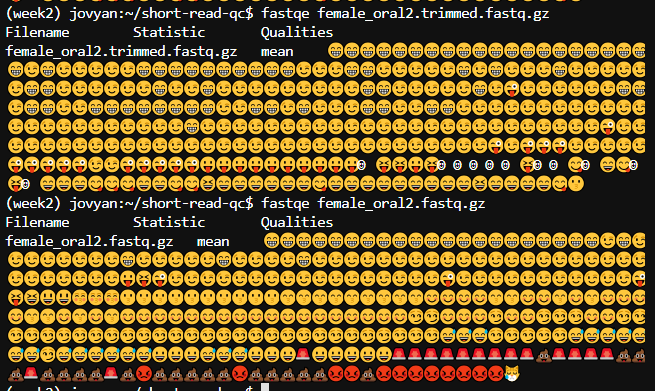
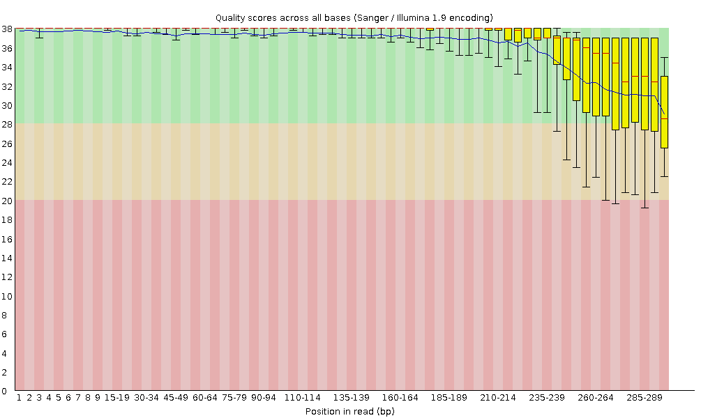
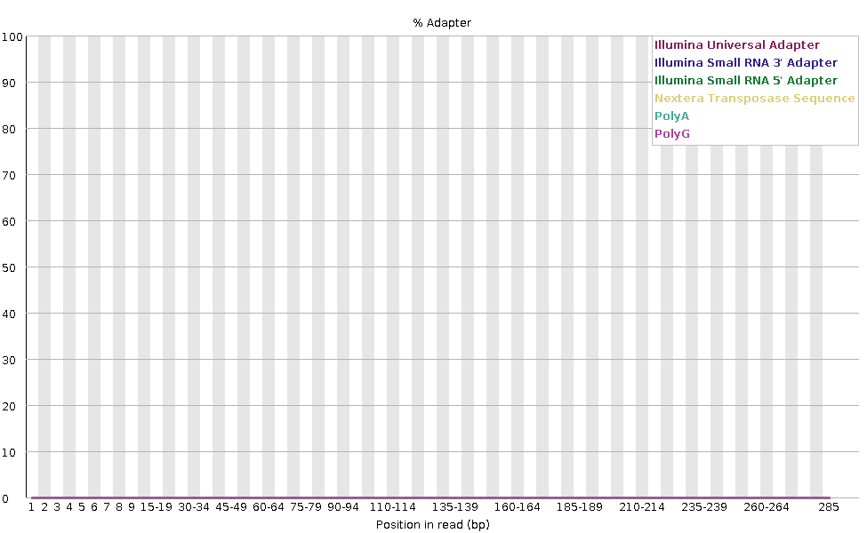
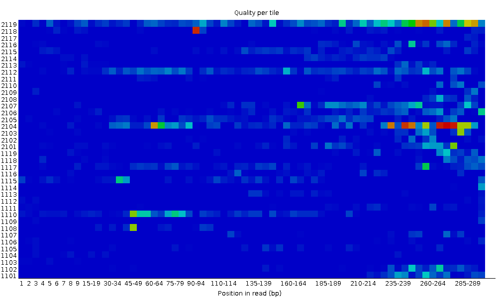
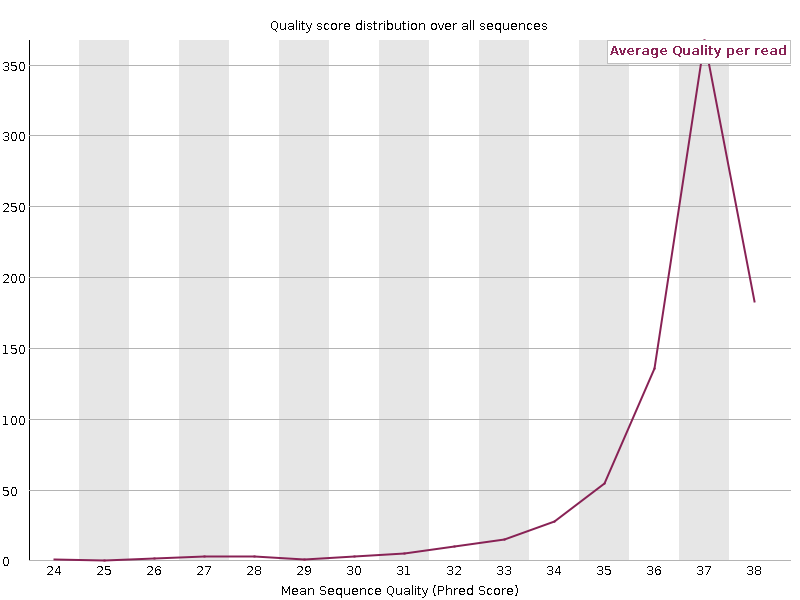

Answers for [short-read-qc exercises]({{site.baseurl}}/modules/sequencing/short-read-qc/)

### Exercise 3: Trim and filter

**Use cutadapt to trim the adapter sequence from the 3' end of the reads, and filter out sequences with a length less than 20 after trimming.**

```
cutadapt -q 20 -a CTGTCTCTTATACACATCT -m 20 female_oral2.fastq.gz  | gzip -c > female_oral2.trimmed.fastq.gz
```

* `-q 20`: This sets the quality threshold to 20, meaning bases with a quality score less than 20 will be trimmed from the ends of the reads.
* `-a CTGTCTCTTATACACATCT`: This specifies the adapter sequence you want to trim from the 3' end of the reads.
* `-m 20`: This filters out sequences with a length less than 20 after trimming. Any read that becomes shorter than 20 bases after trimming will be discarded.
* `female_oral2.fastq.gz`: This is the input FASTQ file containing your raw sequencing data.
* `| gzip -c > female_oral2.trimmed.fastq.gz`: This compresses the output and saves it as a gzipped file.

**Run FASTQE and FASTQC on the trimmed data and compare to the original file.**



```
fastqc  female_oral2.trimmed.fastq.gz
```

**Does the per base sequence quality look better?**



Yes. The vast majority of the bases have a quality score above 20 now.

**Is the adapter gone?**



Yes. No adapter is detected now.

**What can you say about some of the other metrics?**





* We now have one peak of high quality instead of one high and one lower quality that we had previously.
* We don’t have equal representation of the bases as before as this is amplicon data.
* We now have a single main GC peak due to removing the adapter.
* N content is the same as before as we don’t have any Ns in these reads.

If these plots are unclear, you can refer to the notes for the previous exercise, [Answers to exercise 2](/seq-data/short-read-qc-answers). 

Answers for [short-read-qc exercises]({{site.baseurl}}/modules/sequencing/short-read-qc/)

[Back to Programme]({{site.baseurl}}/modules/sequencing/week-2-programme/).
